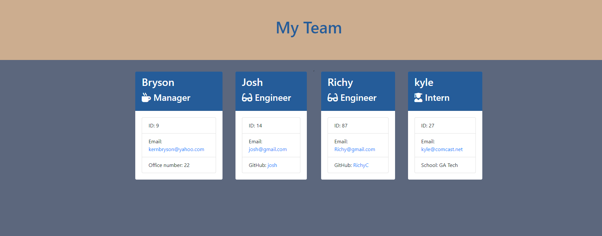
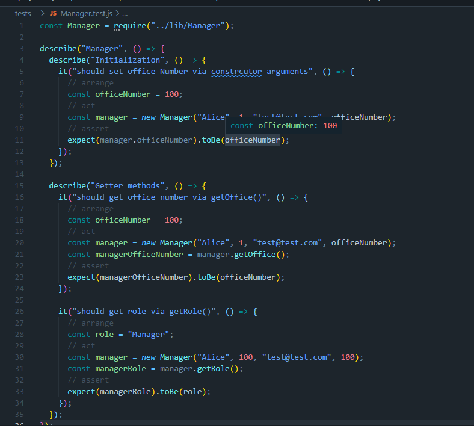

# Team Profile Generator-Bryson Kern

## Description

For this project I created a website that displays your teams information. The reason for creating this website was to simplify keeping track of your workers. While working on this website I learned how to use classes and how you can build classes onto other classes. I also learned how to run tests that can ultimately help you with debugging your code.

## Table of Contents 🧙

- [installation](#installation)
- [Usage](#usage)
- [Tests](#Tests)
- [Credits](#credits)
- [License](#license)
- [Questions](#Questions)

## Installation

In order to install my website, one must download my github repo and type in node index.js in the console to start the prompt.

## Usage

Using my project is very simple. Once the files are loaded on to your vscode, you simply type in node index.js to start the prompt. Once you are finished with the prompt questions, a HTML file will be created in the dist folder that displays your generated team.

## Tests

In order to assure my project worked effectively, I used Jest npm to run my tests. For each test that I created, I made sure all my functions were gathering the correct data. In order to run the tests you simply type npm run test in the terminal.

## Credits

My collaborators for this project were Trey Eckles and Juan Santiago.

## License

    Copyright 2022 Bryson Kern
    Permission is hereby granted, free of charge, to any person obtaining a copy of this software and associated documentation files (the "Software"), to deal in the Software without restriction, including without limitation the rights to use, copy, modify, merge, publish, distribute, sublicense, and/or sell copies of the Software, and to permit persons to whom the Software is furnished to do so, subject to the following conditions:

    The above copyright notice and this permission notice shall be included in all copies or substantial portions of the Software.

    THE SOFTWARE IS PROVIDED "AS IS", WITHOUT WARRANTY OF ANY KIND, EXPRESS OR IMPLIED, INCLUDING BUT NOT LIMITED TO THE WARRANTIES OF MERCHANTABILITY, FITNESS FOR A PARTICULAR PURPOSE AND NONINFRINGEMENT. IN NO EVENT SHALL THE AUTHORS OR COPYRIGHT HOLDERS BE LIABLE FOR ANY CLAIM, DAMAGES OR OTHER LIABILITY, WHETHER IN AN ACTION OF CONTRACT, TORT OR OTHERWISE, ARISING FROM, OUT OF OR IN CONNECTION WITH THE SOFTWARE OR THE USE OR OTHER DEALINGS IN THE SOFTWARE.

## Questions

Feel free to contact me with any questions or concerns!

- email: kernbryson@yahoo.com
- GitHub: https://github.com/kernbryson
